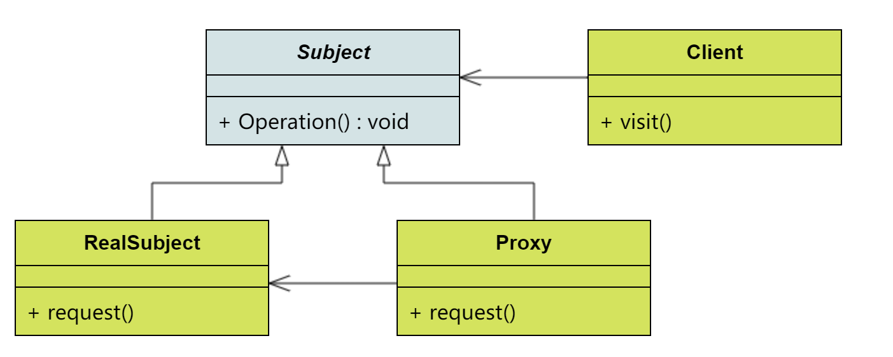

# 设计模式-代理模式

代理模式也是一种非常常见的设计模式。了解Spring框架的都知道，Spring AOP 使用的就是动态代理模式。今天就来系统的重温一遍代理模式。

在现实生活中代理是随处可见的，当事人因某些隐私不方便出面，或者当事人不具备某些相关的专业技能，而需要一个职业人员来完成一些专业的操作，
也可能由于当事人没有时间处理事务，而聘用代理人出面。而在软件设计中，使用代理模式的地方也很多，由于安全原因，屏蔽客户端直接访问真实对象，
或者为了提升系统性能，使用代理模式实现延迟加载，还有就是AOP，对委托类的功能进行增强等。

## 一、代理模式的结构

代理模式的主要参与者有4个，如下图所示：



| 角色 | 作用 |
| --- | --- |
| Subject | 主题接口，定义了代理类和委托类的公共对外方法，也是代理类代理委托类的方法 |
| RealSubject | 委托类，真实主题，真正实现业务逻辑的类 |
| Proxy | 代理类，代理和封装委托类 |
| Client | 客户端，使用代理类和主题接口完成业务逻辑 |

## 二、代理模式的实现

代理模式一般分为静态代理和动态代理两种：
- 静态代理，顾名思义，就是提前创建好代理类文件并在程序运行前已经编译成字节码。
- 动态代理，是指在运行时动态生成代理类，即代理类的字节码将在运行时生成并载入到ClassLoader中。

了解了两种代理模式大概区别后，接下来就以一个短信发送功能增强的示例来详细阐述两种代理的实现方式。

### 1、静态代理实现

第一步，定义主题接口，该接口只有一个`send`方法：
```
public interface ISender {

    public boolean send();
}
```

第二步，定义主题真正实现类：
```
public class SmsSender implements ISender {
    public boolean send() {
        System.out.println("sending msg");
        return true;
    }
}
```

第三步，创建代理类，封装实现类：
```
public class ProxySender implements ISender {

    private ISender sender;

    public ProxySender(ISender sender){
        this.sender = sender;
    }

    public boolean send() {
        System.out.println("处理前");
        boolean result = sender.send();
        System.out.println("处理后");
        return result;
    }
}
```

第四步，客户端调用：
```
@Test
public void testStaticProxy(){
    ISender sender = new ProxySender(new SmsSender());
    boolean result = sender.send();
    System.out.println("输出结果：" + result);
}
```

以上就实现了一个简单的静态代理，很明显，静态代理需要为每个真实主题定义一个形式上完全一样的封装类，
如果真实主题方法有所修改，那代理类也需要跟着修改，不利于系统的维护。

### 2、动态代理实现

与静态代理相比，动态代理有更多优势，动态代理不仅不需要定义代理类，甚至可以在运行时指定代理类的执行逻辑，
从而大大提升系统的灵活性。

目前动态代理类的生成方法有很多，有JDK自带的动态代理、CGLIB、Javassist和ASM库等。
- JDK动态代理：内置在JDK中，不需要引入第三方jar，使用简单，但功能比较弱。
- CGLIB/Javassist：这两个都是高级的字节码生成库，总体性能比JDK动态代理好，且功能强大。
- ASM：低级字节码生成工具，近乎使用bytecode编码，对开发人员要求最高。当然性能也是最好（相比前几种也不是很大的提升，这里不做具体介绍）。

> 以下实例依然以`SmsSender`和`ISender`作为被代理对象和接口进行试验。

#### 1） JDK动态代理

JDK的动态代理需要实现一个处理方法调用的Handler，用于实现代理方法的内部逻辑，实现`InvocationHandler`接口。

```
public class JdkProxyHandler implements InvocationHandler {

    private Object target;

    public JdkProxyHandler(Object target){
        this.target = target;
    }

    public Object invoke(Object proxy, Method method, Object[] args) throws Throwable {
        System.out.println("处理前");
        Object result = method.invoke(target,args);
        System.out.println("处理后");
        return result;
    }
}
```

客户端调用：
```
@Test
public void testJdkProxy(){
    ISender sender = (ISender) Proxy.newProxyInstance(ClassLoader.getSystemClassLoader(),
            new Class[]{ISender.class},
            new JdkProxyHandler(new SmsSender()));
    boolean result = sender.send();
    System.out.println("代理对象：" + sender.getClass().getName());
    System.out.println("输出结果：" + result);
}
```

输出结果：

```
处理前
sending msg
处理后
代理对象：com.sun.proxy.$Proxy4
输出结果：true
```

这样实现一个简单的AOP就完成了，我们看到代理类的类型是`com.sun.proxy.$Proxy4`。那JDK是如何创建代理类？
首先从Proxy.newProxyInstance入手，来研究JDK是如何生成代理类：

    public static Object newProxyInstance(ClassLoader loader, Class<?>[] interfaces, InvocationHandler h)
    
该方法有3个参数：
- loader：用哪个类加载器去加载代理对象，生成目标对象的代理需要确保其类加载器相同，所以需要将目标对象的类加载器作为参数传递。
- interfaces：代理类需实现的接口列表，JDK动态代理技术需要代理类和目标对象都继承自同一接口，所以需要将目标对象的接口作为参数传递。
- h：调用处理器，调用实现了InvocationHandler类的一个回调方法，对目标对象的增强逻辑在这个实现类中。

具体代码如下：
```
public static Object newProxyInstance(ClassLoader loader,
                                          Class<?>[] interfaces,
                                          InvocationHandler h) throws IllegalArgumentException {
    //1.检查
    Objects.requireNonNull(h);

    final Class<?>[] intfs = interfaces.clone();
    final SecurityManager sm = System.getSecurityManager();
    if (sm != null) {
        checkProxyAccess(Reflection.getCallerClass(), loader, intfs);
    }

    /*
     * Look up or generate the designated proxy class.
     */
    //获取代理类类型
    Class<?> cl = getProxyClass0(loader, intfs);

    /*
     * Invoke its constructor with the designated invocation handler.
     */
    try {
        if (sm != null) {
            checkNewProxyPermission(Reflection.getCallerClass(), cl);
        }

        //通过反射创建代理对象
        final Constructor<?> cons = cl.getConstructor(constructorParams);
        final InvocationHandler ih = h;
        if (!Modifier.isPublic(cl.getModifiers())) {
            AccessController.doPrivileged(new PrivilegedAction<Void>() {
                public Void run() {
                    cons.setAccessible(true);
                    return null;
                }
            });
        }
        return cons.newInstance(new Object[]{h});
    } catch (IllegalAccessException|InstantiationException e) {
        throw new InternalError(e.toString(), e);
    } catch (InvocationTargetException e) {
        Throwable t = e.getCause();
        if (t instanceof RuntimeException) {
            throw (RuntimeException) t;
        } else {
            throw new InternalError(t.toString(), t);
        }
    } catch (NoSuchMethodException e) {
        throw new InternalError(e.toString(), e);
    }
}
```

总结：具体代码细节就不在这里深究，但可以明显的看出，**JDK的动态代理底层是通过Java反射机制实现的，并且需要目标对象继承自一个接口才能生成它的代理类**。

#### 2） CGLIB(Code Generation Library)动态代理

使用CGLIB动态代理前需要引入依赖：

```
<dependency>
    <groupId>cglib</groupId>
    <artifactId>cglib</artifactId>
    <version>3.3.0</version>
</dependency>
```

> 和JDK代理不同，CGLib动态代理技术不需要目标对象实现自一个接口，只需要实现一个处理代理逻辑的切入类，并实现`MethodInterceptor`接口。

定义真实主题实现类：
```
public class BdSender {

    public boolean send() {
        System.out.println("sending msg");
        return true;
    }
}
```

代理类逻辑处理类：
```
public class CglibProxyInterceptor implements MethodInterceptor {

    private Enhancer enhancer = new Enhancer();

    /**
     * 获取代理类
     * @param clazz
     * @return
     */
    public Object getProxy(Class clazz) {
        enhancer.setSuperclass(clazz);
        enhancer.setCallback(this);
        return enhancer.create();
    }

    public Object intercept(Object object, Method method, Object[] args, MethodProxy methodProxy) throws Throwable {
        System.out.println("处理前");
        Object result = methodProxy.invokeSuper(object,args);
        System.out.println("处理后");
        return result;
    }
}
```

客户端调用：

```
@Test
public void testCglibProxy(){
    BdSender sender = (BdSender) new CglibProxyInterceptor().getProxy(BdSender.class);
    boolean result = sender.send();
    System.out.println("代理对象：" + sender.getClass().getName());
    System.out.println("输出结果：" + result);
}
```

输出结果：

```
处理前
sending msg
处理后
代理对象：org.yd.proxy.BdSender$$EnhancerByCGLIB$$d65f9e34
输出结果：true
```

总结CgLib的特点：
- 使用CGLib实现动态代理，完全不受代理类必须实现接口的限制
- CGLib底层采用ASM字节码生成框架，使用字节码技术生成代理类，比使用Java反射效率要高
- CGLib不能对声明为final的方法进行代理，因为CGLib原理是动态生成被代理类的子类

#### 3） Javassist动态代理

> Javassist是一个开源的分析、编辑和创建Java字节码的类库，可以直接编辑和生成Java生成的字节码。
>相对于bcel, asm等这些工具，开发者不需要了解虚拟机指令，就能动态改变类的结构，或者动态生成类。

使用avassist动态代理前需要引入依赖：

```
<dependency>
    <groupId>org.javassist</groupId>
    <artifactId>javassist</artifactId>
    <version>3.27.0-GA</version>
</dependency>
```

使用Javassist生成动态代理可以有以下两种方式：
- 代理工厂创建：需要实现`MethodHandler`用于代理逻辑处理，实现与CGLib非常类似
- 动态代码创建：可通过Java代码生成字节码，这种方式创建的动态代理非常灵活，甚至可以在运行时生成业务逻辑


##### 代理工厂创建 — 代理逻辑处理类

```
public class JavassistProxyHandler implements MethodHandler {

    private ProxyFactory proxyFactory = new ProxyFactory();

    /**
     * 获取代理对象
     * @param clazz 被代理类
     * @return
     * @throws Exception
     */
    public Object getProxy(Class clazz) throws Exception {
        proxyFactory.setSuperclass(clazz);
        Class<?> factoryClass = proxyFactory.createClass();
        Object proxy = factoryClass.newInstance();
        ((ProxyObject)proxy).setHandler(this);
        return proxy;
    }

    public Object invoke(Object object, Method method, Method method1, Object[] args) throws Throwable {
        System.out.println("处理前");
        Object result = method1.invoke(object,args);
        System.out.println("处理后");
        return result;
    }
}
```

客户端调用：

```
@Test
public void testJavassistProxy() throws Exception {
    BdSender sender = (BdSender) new JavassistProxyHandler().getProxy(BdSender.class);
    boolean result = sender.send();
    System.out.println("代理对象：" + sender.getClass().getName());
    System.out.println("输出结果：" + result);
}
```

输出结果

```
处理前
sending msg
处理后
代理对象：org.yd.proxy.BdSender_$$_jvstbce_0
输出结果：true
```

##### 动态代码创建 — 代理逻辑处理类：

```
public static Object getProxy(Class clazz) throws Exception {
    ClassPool mPool = ClassPool.getDefault();
    CtClass c0 = mPool.get(clazz.getName());
    //定义代理类名称
    CtClass mCtc = mPool.makeClass(clazz.getName() + "$$BytecodeProxy");
    //添加父类继承
    mCtc.setSuperclass(c0);
    //添加类的字段信息
    CtField field = new CtField(c0, "real", mCtc);
    field.setModifiers(AccessFlag.PRIVATE);
    mCtc.addField(field);
    //添加构造函数
    CtConstructor constructor = new CtConstructor(new CtClass[]{c0},mCtc);
    constructor.setBody("{$0.real = $1;}"); // $0代表this, $1代表构造函数的第1个参数
    mCtc.addConstructor(constructor);
    //添加方法
    CtMethod ctMethod = mCtc.getSuperclass().getDeclaredMethod("send");
    CtMethod newMethod = new CtMethod(ctMethod.getReturnType(), ctMethod.getName(),ctMethod.getParameterTypes(), mCtc);
    newMethod.setBody("{" +
            "System.out.println(\"处理前\");" +
            "boolean result = $0.real.send();" +
            "System.out.println(\"处理后\");" +
            "return result;}");
    mCtc.addMethod(newMethod);

    //生成动态类
    return mCtc.toClass().getConstructor(clazz).newInstance(clazz.newInstance());
}
```

客户端调用：

```
@Test
public void testJavassisBytecodetProxy() throws Exception {
    BdSender sender = (BdSender) JavassistDynamicCodeProxy.getProxy(BdSender.class);
    boolean result = sender.send();
    System.out.println("代理对象：" + sender.getClass().getName());
    System.out.println("输出结果：" + result);
}
```

输出结果：

```
处理前
sending msg
处理后
代理对象：org.yd.proxy.BdSender$$BytecodeProxy
输出结果：true
```

> Javassist被用于struts2和hibernate中，都用来做动态字节码修改使用。一般开发中不会用到，但在封装框架时比较有用。
>具体语法可参考：[Javassist官方地址传送门](http://www.javassist.org/tutorial/tutorial.html)

以上介绍了静态代理和动态代理创建的几种方法与优缺点介绍，希望可以帮到大家。